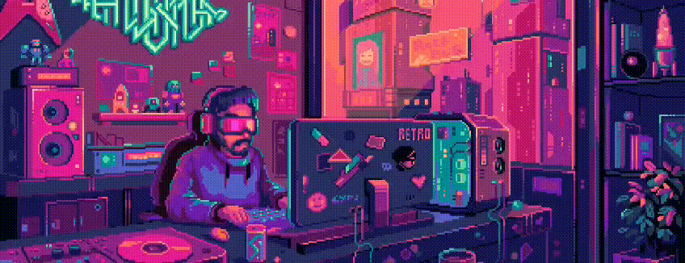

  
   

   <h1>Hello there, I'm Shantanu 
    
   </h1>

<!--icons from:  https://skillicons.dev/icons?i=linkedin -->

&nbsp;&nbsp;&nbsp;&nbsp;&nbsp;&nbsp;&nbsp;&nbsp;&nbsp;&nbsp;&nbsp;&nbsp;
 

<h3 align="center">I love to build stuff with code and electronics</h3>

|  | 
| ------------- | ------------- |

 

<!-- change alt tags -->
 
### Languages and Tools...

    

    

    

    

    

   

    

    

    

    

    

    

    

    

   

  

#### My Best Repositories

  

  
  

  

 
 
